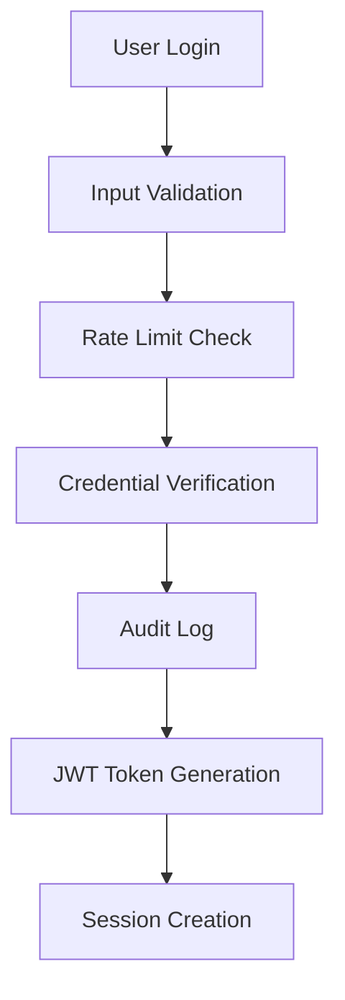

# Security Implementation Guide

This document outlines the comprehensive security measures implemented in Vanity Hub.

## 🔐 Security Features Overview

### ✅ **Implemented Security Measures**

1. **Authentication & Authorization**
   - ✅ NextAuth.js with JWT tokens
   - ✅ bcrypt password hashing (12 salt rounds)
   - ✅ Role-based access control (RBAC)
   - ✅ Session management with configurable timeouts
   - ✅ Comprehensive audit logging

2. **Input Validation & Sanitization**
   - ✅ Zod schema validation for all inputs
   - ✅ DOMPurify for HTML sanitization
   - ✅ SQL injection prevention via Prisma ORM
   - ✅ XSS protection with input escaping

3. **Rate Limiting**
   - ✅ Redis-based rate limiting (with memory fallback)
   - ✅ Configurable limits per endpoint
   - ✅ User-specific and IP-based limiting
   - ✅ Automatic rate limit headers

4. **Security Headers**
   - ✅ Content Security Policy (CSP)
   - ✅ X-Frame-Options: DENY
   - ✅ X-Content-Type-Options: nosniff
   - ✅ X-XSS-Protection
   - ✅ HSTS (production only)
   - ✅ Referrer Policy

5. **Audit Logging**
   - ✅ Comprehensive action tracking
   - ✅ Security event monitoring
   - ✅ Failed login attempt logging
   - ✅ Suspicious activity detection

6. **Password Security**
   - ✅ Strong password requirements
   - ✅ Password strength validation
   - ✅ Common password rejection
   - ✅ Secure password generation

## 🛡️ Security Architecture

### Authentication Flow



### API Security Wrapper

```typescript
// Example usage of security wrapper
export const POST = withAuth(async (req) => {
  const userData = req.validatedData
  // Your API logic here
  return NextResponse.json({ success: true })
}, {
  rateLimit: rateLimits.moderate,
  validateInput: userCreationSchema,
  auditAction: 'CREATE_USER'
})
```

## 🔧 Configuration

### Environment Variables

```env
# Security Configuration
NEXTAUTH_SECRET=your-super-secure-secret-key
REDIS_URL=redis://localhost:6379
REDIS_PASSWORD=your-redis-password

# Rate Limiting
RATE_LIMIT_ENABLED=true
RATE_LIMIT_REDIS_URL=redis://localhost:6379

# Audit Logging
AUDIT_LOG_ENABLED=true
AUDIT_LOG_LEVEL=INFO

# Password Policy
PASSWORD_MIN_LENGTH=8
PASSWORD_REQUIRE_UPPERCASE=true
PASSWORD_REQUIRE_LOWERCASE=true
PASSWORD_REQUIRE_NUMBERS=true
PASSWORD_REQUIRE_SYMBOLS=true
```

### Rate Limit Configuration

```typescript
// Predefined rate limits
export const rateLimits = {
  strict: { windowMs: 15 * 60 * 1000, maxRequests: 10 },
  moderate: { windowMs: 15 * 60 * 1000, maxRequests: 50 },
  lenient: { windowMs: 15 * 60 * 1000, maxRequests: 100 },
  login: { windowMs: 15 * 60 * 1000, maxRequests: 5 },
}
```

## 📊 Audit Logging

### Tracked Events

- **Authentication**: Login success/failure, logout, password changes
- **User Management**: User creation, updates, deletion, activation/deactivation
- **Data Access**: Client viewing, sensitive data exports
- **Security Events**: Unauthorized access attempts, rate limit violations
- **System Events**: Configuration changes, maintenance mode

### Audit Log Structure

```typescript
interface AuditLogEntry {
  action: AuditAction
  userId?: string
  userEmail?: string
  userRole?: string
  resourceType?: string
  resourceId?: string
  details?: Record<string, any>
  ipAddress?: string
  userAgent?: string
  severity: 'LOW' | 'MEDIUM' | 'HIGH' | 'CRITICAL'
  metadata?: Record<string, any>
}
```

## 🚨 Security Monitoring

### Suspicious Activity Detection

The system automatically detects and logs:
- Directory traversal attempts (`../`)
- XSS injection attempts (`<script>`)
- SQL injection patterns (`UNION SELECT`)
- Malicious user agents
- Repeated failed login attempts
- Unusual access patterns

### Alert Thresholds

- **Critical**: Immediate notification required
  - Unauthorized admin access attempts
  - Data deletion/modification by unauthorized users
  - System configuration changes

- **High**: Review within 1 hour
  - Multiple failed login attempts
  - Password changes
  - User privilege escalations

- **Medium**: Review within 24 hours
  - Rate limit violations
  - Suspicious user agent patterns

## 🔒 Password Policy

### Requirements
- Minimum 8 characters
- At least one uppercase letter
- At least one lowercase letter
- At least one number
- At least one special character
- Not in common password list
- No sequential characters (abc, 123)

### Password Strength Levels
1. **Very Weak** (0-1 points): Rejected
2. **Weak** (2 points): Rejected
3. **Fair** (3 points): Minimum acceptable
4. **Good** (4 points): Recommended
5. **Strong** (5 points): Excellent
6. **Very Strong** (6+ points): Exceptional

## 🛠️ Implementation Examples

### Secure API Route

```typescript
import { withAuth, rateLimits } from '@/lib/security/api-wrapper'
import { clientCreationSchema } from '@/lib/security/validation'

export const POST = withAuth(async (req) => {
  const clientData = req.validatedData
  
  // Create client logic
  const client = await prisma.client.create({
    data: clientData
  })
  
  return NextResponse.json({ client })
}, {
  rateLimit: rateLimits.moderate,
  validateInput: clientCreationSchema,
  auditAction: 'CREATE_CLIENT'
})
```

### Password Validation

```typescript
import { validatePassword, hashPassword } from '@/lib/security/password'

const validation = validatePassword(password)
if (!validation.isValid) {
  return { errors: validation.errors }
}

const hashedPassword = await hashPassword(password)
```

## 📈 Security Metrics

### Key Performance Indicators (KPIs)

1. **Authentication Security**
   - Failed login rate < 5%
   - Average session duration
   - Password change frequency

2. **API Security**
   - Rate limit hit rate < 1%
   - Blocked suspicious requests
   - API response times

3. **Audit Coverage**
   - 100% of sensitive operations logged
   - Alert response time < 1 hour
   - Security incident resolution time

## 🔄 Security Maintenance

### Regular Tasks

1. **Daily**
   - Review critical security alerts
   - Monitor failed login attempts
   - Check rate limit violations

2. **Weekly**
   - Audit log analysis
   - Security metric review
   - Password policy compliance check

3. **Monthly**
   - Security configuration review
   - Dependency vulnerability scan
   - Access control audit

4. **Quarterly**
   - Penetration testing
   - Security policy updates
   - Staff security training

## 🚀 Deployment Security

### Production Checklist

- [ ] HTTPS enabled with valid SSL certificate
- [ ] Security headers configured
- [ ] Rate limiting enabled
- [ ] Audit logging active
- [ ] Database access restricted
- [ ] Environment variables secured
- [ ] Backup encryption enabled
- [ ] Monitoring alerts configured

### Security Headers Verification

```bash
# Test security headers
curl -I https://your-domain.com

# Expected headers:
# X-Frame-Options: DENY
# X-Content-Type-Options: nosniff
# X-XSS-Protection: 1; mode=block
# Strict-Transport-Security: max-age=31536000
```

## 📞 Incident Response

### Security Incident Procedure

1. **Detection**: Automated alerts or manual discovery
2. **Assessment**: Determine severity and impact
3. **Containment**: Isolate affected systems
4. **Investigation**: Analyze logs and determine root cause
5. **Recovery**: Restore normal operations
6. **Documentation**: Record incident details and lessons learned

### Emergency Contacts

- **Security Team**: security@vanityhub.com
- **System Administrator**: admin@vanityhub.com
- **On-call Engineer**: +974-XXXX-XXXX

## 📚 Additional Resources

- [OWASP Top 10](https://owasp.org/www-project-top-ten/)
- [NextAuth.js Security](https://next-auth.js.org/configuration/options#security)
- [Prisma Security Best Practices](https://www.prisma.io/docs/guides/performance-and-optimization/query-optimization-performance)
- [Node.js Security Checklist](https://blog.risingstack.com/node-js-security-checklist/)
